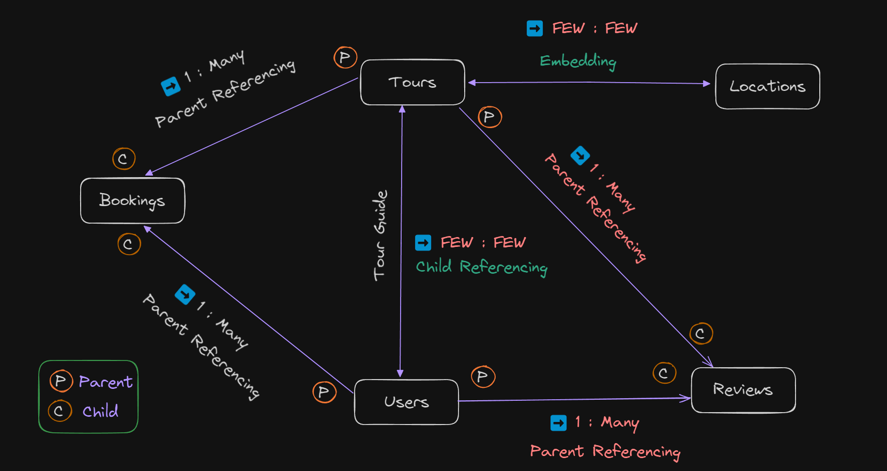

# Data Model for Tour Booking System

This document explains the data model for a tour booking system, including the relationships between various entities such as Tours, Locations, Users, Bookings, and Reviews.

-   

## Entities and Relationships

### Tours and Locations

-   **Type**: Embedding (Few: Few)
-   **Description**: Locations are embedded within Tours, indicating a close relationship where a Tour includes a few Locations, and each Location can be part of a few Tours.

### Tours and Reviews

-   **Type**: 1 : Many Parent Referencing
-   **Description**: A Tour can have many Reviews, and each Review references a single Tour.

### Tours and Bookings

-   **Type**: 1 : Many Parent Referencing
-   **Description**: A Tour can have many Bookings, and each Booking references a single Tour.

### Users and Reviews

-   **Type**: 1 : Many Parent Referencing
-   **Description**: A User can write many Reviews, and each Review references a single User.

### Users and Bookings

-   **Type**: 1 : Many Parent Referencing
-   **Description**: A User can make many Bookings, and each Booking references a single User.

### Users and Tours (as Guides)

-   **Type**: Few: Few Child Referencing
-   **Description**: Users can act as Tour Guides for Tours. This relationship suggests that each User can be a guide for a few Tours, and each Tour can have a few guides.

### This model uses different types of relationships:

-   **Parent Referencing**: The parent entity is referenced in the child entity, indicating a one-to-many relationship.
-   **Child Referencing**: The child entity is referenced in the parent entity, indicating a many-to-many relationship in a limited scope (Few: Few).
-   **Embedding**: One entity is embedded within another, indicating a very close relationship.
