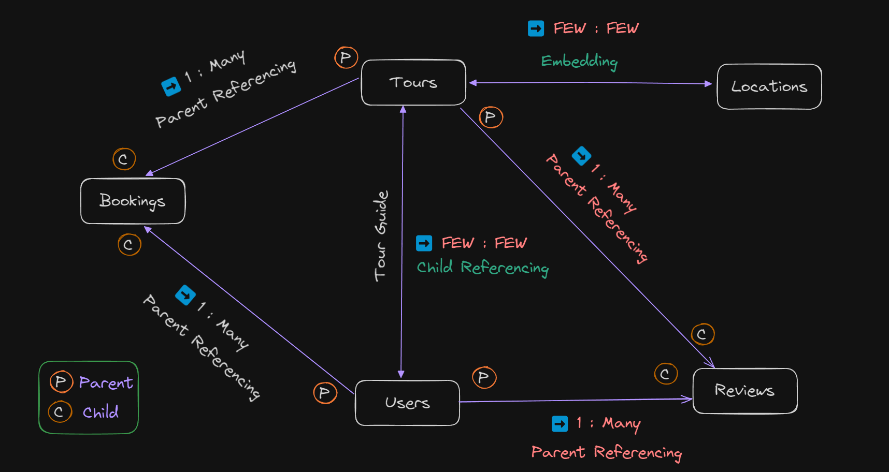

# Natours API Documentation

The Natours API is designed to provide a robust and flexible platform for managing tour-related data and user information. This API serves as the backend for the Natours application, which facilitates the creation, retrieval, updating, and deletion of tour details, as well as user management. The endpoints are organized to handle various operations seamlessly, making it easy to integrate with front-end applications and third-party services.

## Resources Overview

### Tours

The Tours resource provides endpoints to manage tour data. This includes operations to create new tours, retrieve existing tours, update tour details, and delete tours. Additionally, it offers endpoints to fetch statistical data, top-rated tours, monthly plans, and tours within a specific radius or distance.

### Users

The Users resource encompasses endpoints for managing user data. This includes fetching user details, updating user information, and deleting user accounts. The API supports operations for both regular users and administrators, ensuring secure and efficient user management.

### Authentications

The Authentications resource provides endpoints for user authentication processes, including signing up, logging in, and password management. These endpoints ensure secure access to the Natours application and allow users to manage their credentials effectively.

### Reviews

The Reviews resource provides endpoints to manage reviews for tours. Users can create, retrieve, update, and delete reviews, enhancing the interaction and feedback system for the tours.

### Tours/Reviews

The Tours/Reviews resource provides specialized endpoints to manage reviews related to specific tours. These endpoints facilitate the association of reviews with their respective tours, enhancing the feedback mechanism.

### Data Model for Tour Booking System

This document explains the data model for a tour booking system, including the relationships between various entities such as Tours, Locations, Users, Bookings, and Reviews.

-   

## Detailed Endpoint Descriptions

### Tours Endpoints

1. **Get All The Tours**

    - **Endpoint:** GET /tours
    - **Description:** Retrieves a comprehensive list of all available tours. Useful for displaying all tour options to users.
    - **Request Parameters:** None
    - **Response:**
        - **Status:** 200 OK
        - **Body:** An array of tour objects containing details like name, duration, difficulty, and price.

2. **Get Tour By ID**

    - **Endpoint:** GET /tours/:id
    - **Description:** Fetches details of a specific tour by its unique identifier. Essential for viewing detailed information about a particular tour.
    - **Request Parameters:**
        - **Path:** id (String, required)
    - **Response:**
        - **Status:** 200 OK
        - **Body:** A single tour object with detailed information.

3. **Get Top Tours**

    - **Endpoint:** GET /tours/top-tours
    - **Description:** Retrieves a list of top-rated tours, often based on user reviews and ratings. Ideal for highlighting popular tours.
    - **Request Parameters:** None
    - **Response:**
        - **Status:** 200 OK
        - **Body:** An array of top-rated tour objects.

4. **Get Monthly Plan**

    - **Endpoint:** GET /tours/monthly-plan
    - **Description:** Provides a plan of tours scheduled for the current month. Useful for users looking to book tours within the month.
    - **Request Parameters:** None
    - **Response:**
        - **Status:** 200 OK
        - **Body:** An array of tour objects scheduled for the current month.

5. **Get Tour Stats**

    - **Endpoint:** GET /tours/tour-stats
    - **Description:** Returns statistical data about tours, such as the number of tours, average ratings, and other aggregations. Helps in analyzing tour performance.
    - **Request Parameters:** None
    - **Response:**
        - **Status:** 200 OK
        - **Body:** An object containing statistical data.

6. **Update Tour**

    - **Endpoint:** PATCH /tours/:id
    - **Description:** Updates details of an existing tour identified by its ID. Allows modification of tour attributes like price, description, and availability.
    - **Request Parameters:**
        - **Path:** id (String, required)
        - **Body:** JSON object with tour attributes to update.
    - **Response:**
        - **Status:** 200 OK
        - **Body:** The updated tour object.

7. **Create New Tour**

    - **Endpoint:** POST /tours
    - **Description:** Creates a new tour with specified details. Enables adding new tours to the system.
    - **Request Parameters:**
        - **Body:** JSON object with new tour details.
    - **Response:**
        - **Status:** 201 Created
        - **Body:** The newly created tour object.

8. **Delete Tour**

    - **Endpoint:** DELETE /tours/:id
    - **Description:** Deletes a tour identified by its ID. Permanently removes the tour from the system.
    - **Request Parameters:**
        - **Path:** id (String, required)
    - **Response:**
        - **Status:** 204 No Content

9. **Get Tours Within Radius**

    - **Endpoint:** GET /tours-within/:distance/center/:latlng/unit/:unit
    - **Description:** Fetches tours within a specified distance from a geographical point. Useful for users looking for nearby tours.
    - **Request Parameters:**
        - **Path:** distance (Number, required)
        - **Path:** latlng (String, required, format: "lat,lng")
        - **Path:** unit (String, required, "mi" or "km")
    - **Response:**
        - **Status:** 200 OK
        - **Body:** An array of tour objects within the specified radius.

10. **Get Distance to Tours**
    - **Endpoint:** GET /distances/:latlng/unit/:unit
    - **Description:** Calculates distances from a specified point to all available tours. Useful for determining proximity.
    - **Request Parameters:**
        - **Path:** latlng (String, required, format: "lat,lng")
        - **Path:** unit (String, required, "mi" or "km")
    - **Response:**
        - **Status:** 200 OK
        - **Body:** An array of distance objects with tour details and distances.

### Users Endpoints

1. **Get All Users**

    - **Endpoint:** GET /users
    - **Description:** Retrieves a list of all registered users. Useful for administrative purposes.
    - **Request Parameters:** None
    - **Response:**
        - **Status:** 200 OK
        - **Body:** An array of user objects with user details.

2. **Get User By ID**

    - **Endpoint:** GET /users/:id
    - **Description:** Fetches details of a specific user by their unique ID. Essential for viewing individual user information.
    - **Request Parameters:**
        - **Path:** id (String, required)
    - **Response:**
        - **Status:** 200 OK
        - **Body:** A single user object with detailed information.

3. **Update Me**

    - **Endpoint:** PATCH /users/update-me
    - **Description:** Updates the current user's profile information. Allows users to modify their own details.
    - **Request Parameters:**
        - **Body:** JSON object with user attributes to update.
    - **Response:**
        - **Status:** 200 OK
        - **Body:** The updated user object.

4. **Delete Me**

    - **Endpoint:** DELETE /users/delete-me
    - **Description:** Deletes the current user's account. Permanently removes user data from the system.
    - **Request Parameters:** None
    - **Response:**
        - **Status:** 204 No Content

5. **Update User <Admin>**

    - **Endpoint:** PATCH /users/:id
    - **Description:** Updates details of a specific user by their ID (admin only). Allows administrators to modify user attributes.
    - **Request Parameters:**
        - **Path:** id (String, required)
        - **Body:** JSON object with user attributes to update.
    - **Response:**
        - **Status:** 200 OK
        - **Body:** The updated user object.

6. **Delete User <Admin>**

    - **Endpoint:** DELETE /users/:id
    - **Description:** Deletes a user identified by their ID (admin only). Permanently removes user data from the system.
    - **Request Parameters:**
        - **Path:** id (String, required)
    - **Response:**
        - **Status:** 204 No Content

7. **Get Current User**
    - **Endpoint:** GET /users/me
    - **Description:** Retrieves the details of the currently authenticated user. Useful for displaying user profile information.
    - **Request Parameters:** None
    - **Response:**
        - **Status:** 200 OK
        - **Body:** The current user's object with detailed information.

### Authentications Endpoints

1. **Signup**

    - **Description:** Registers a new user by creating an account with provided credentials. Necessary for accessing protected routes and features of the application.

2. **Login**

    - **Description:** Authenticates an existing user using their credentials. Upon successful login, returns a token for accessing protected routes.

3. **Forget Password**

    - **Description:** Initiates the password reset process by sending a reset token to the user's email. Allows users to recover access to their account.

4. **Update Password**

    - **Description:** Allows authenticated users to update their password. Ensures the account remains secure by changing credentials.

5. **Reset Password**
    - **Description:** Resets the user's password using a valid reset token. Completes the password recovery process initiated by the "forget password" endpoint.

### Reviews Endpoints

1. **Get All Reviews**

    - **Description:** Retrieves a list of all reviews in the system. Useful for administrators to monitor feedback and for users to read others' experiences.

2. **Get Review**

    - **Description:** Fetches a specific review by its ID. Allows users to view detailed feedback about a particular tour.

3. **Create Review**

    - **Description:** Allows users to create a new review for a tour. Users can share their experiences and rate the tours they have taken.

4. **Update Review**

    - **Description:** Updates an existing review identified by its ID. Enables users to modify their feedback if needed.

5. **Delete Review**
    - **Description:** Deletes a review identified by its ID. Allows users to remove their feedback from the system.

### Tours/Reviews Endpoints

1. **Get All Reviews on Specific Tour**

    - **Description:** Retrieves all reviews associated with a specific tour. Provides users with feedback and ratings related to the tour they are interested in.

2. **Create New Review on Tours**
    - **Description:** Creates a new review for a specific tour. Allows users to rate and provide feedback directly related to the tour.

# Data Model for Tour Booking System

## Entities and Relationships

### Tours and Locations

-   **Type**: Embedding (Few: Few)
-   **Description**: Locations are embedded within Tours, indicating a close relationship where a Tour includes a few Locations, and each Location can be part of a few Tours.

### Tours and Reviews

-   **Type**: 1 : Many Parent Referencing
-   **Description**: A Tour can have many Reviews, and each Review references a single Tour.

### Tours and Bookings

-   **Type**: 1 : Many Parent Referencing
-   **Description**: A Tour can have many Bookings, and each Booking references a single Tour.

### Users and Reviews

-   **Type**: 1 : Many Parent Referencing
-   **Description**: A User can write many Reviews, and each Review references a single User.

### Users and Bookings

-   **Type**: 1 : Many Parent Referencing
-   **Description**: A User can make many Bookings, and each Booking references a single User.

### Users and Tours (as Guides)

-   **Type**: Few: Few Child Referencing
-   **Description**: Users can act as Tour Guides for Tours. This relationship suggests that each User can be a guide for a few Tours, and each Tour can have a few guides.

### This model uses different types of relationships:

-   **Parent Referencing**: The parent entity is referenced in the child entity, indicating a one-to-many relationship.
-   **Child Referencing**: The child entity is referenced in the parent entity, indicating a many-to-many relationship in a limited scope (Few: Few).
-   **Embedding**: One entity is embedded within another, indicating a very close relationship.
